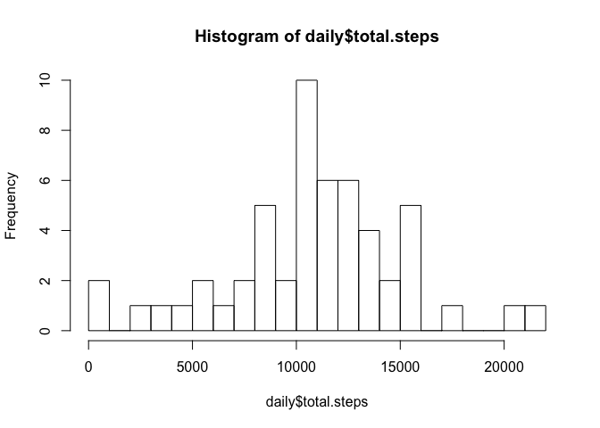
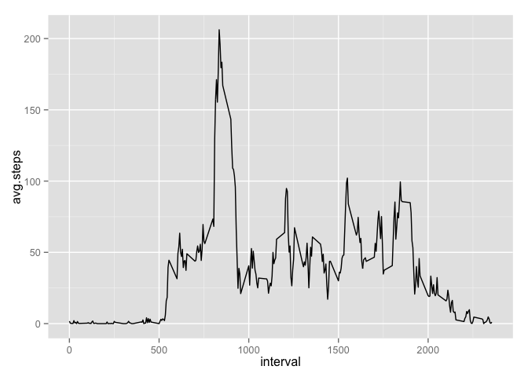

# Reproducible Research: Peer Assessment 1


## Loading and preprocessing the data

```r
dataset <- read.csv('activity.csv')
head(dataset[is.na(dataset$steps)==FALSE & dataset$steps > 0,], n=10)
```

```
##     steps       date interval
## 555   117 2012-10-02     2210
## 556     9 2012-10-02     2215
## 627     4 2012-10-03      410
## 631    36 2012-10-03      430
## 644    25 2012-10-03      535
## 647    90 2012-10-03      550
## 648   411 2012-10-03      555
## 649   413 2012-10-03      600
## 650   415 2012-10-03      605
## 651   519 2012-10-03      610
```

```r
typeof(dataset)
```

```
## [1] "list"
```

```r
typeof(dataset$steps)
```

```
## [1] "integer"
```

```r
typeof(dataset$date)
```

```
## [1] "integer"
```

```r
typeof(dataset$interval)
```

```
## [1] "integer"
```

## What is mean total number of steps taken per day?
Calculate the total number of steps taken per day.

```r
# Include the plyr library to be able to use the ddply function
library(plyr)
# Summarize the dataset by date
daily <- ddply(dataset, "date", summarize, total.steps = sum(steps))
```

Make a histogram of the total number of steps taken each day.

```r
hist(daily$total.steps, breaks=20)
```

 

Calculate and report the mean and median of the total number of steps taken per day.

```r
daily.mean <- mean(daily$total.steps, na.rm=TRUE)
daily.median <- median(daily$total.steps, na.rm=TRUE)
```
The mean daily steps taken is 10766.19 and the median daily steps taken is 10765.

## What is the average daily activity pattern?
Make a time series plot (i.e. type = "l") of the 5-minute interval (x-axis) and the average number of steps taken, averaged across all days (y-axis)

```r
# Import the ggplot library
library(ggplot2)
# Calculate a typical day by averaging the number of steps taken at each interval
typical.day <- ddply(dataset, "interval", summarize, avg.steps = mean(steps, na.rm=TRUE))
ggplot(data=typical.day, mapping=aes(x=interval, y=avg.steps)) + geom_line()
```

 

Which 5-minute interval, on average across all the days in the dataset, contains the maximum number of steps?

```r
# Order the data frame by average steps descending to find the interval with the most steps
ordered <- arrange(typical.day, desc(avg.steps))
#strftime(ordered[1,1], format="%H%M")
```
The interval with the maximum number of steps is ``835``.

## Imputing missing values
Calculate and report the total number of missing values in the dataset (i.e. the total number of rows with NAs)

```r
na.dataset <- subset(dataset, subset = is.na(steps))
```
There are ``2304`` rows with missing values.

Devise a strategy for filling in all of the missing values in the dataset. The strategy does not need to be sophisticated. For example, you could use the mean/median for that day, or the mean for that 5-minute interval, etc.

```r
# Merge the na.dataset with the typical day dataset
na.merged <- merge(x=na.dataset, y=typical.day, all.x = TRUE, all.y = FALSE, by = 'interval')
na.merged$steps <- na.merged$avg.steps

# Create a new dataset that is equal to the original dataset but with the missing data filled in.
dataset.merged <- merge(x=dataset, y=na.merged, all.x=TRUE, all.y=FALSE, by=c('date','interval'))
# Create a new column
dataset.merged$steps <- 0
# If one value for steps.? is missing, replace the steps variable for the one that is set
dataset.merged[is.na(dataset.merged$steps.x)==TRUE,]$steps <- dataset.merged[is.na(dataset.merged$steps.x)==TRUE,]$steps.y
dataset.merged[is.na(dataset.merged$steps.y)==TRUE,]$steps <- dataset.merged[is.na(dataset.merged$steps.y)==TRUE,]$steps.x
# Subset the new dataset to include only the necessary columns
dataset.merged <- subset(dataset.merged, select=c('steps', 'date', 'interval'))

#Make a histogram of the total number of steps taken each day and Calculate and report the mean and median total number of steps taken per day.
daily.merged <- ddply(dataset.merged, "date", summarize, total.steps = sum(steps))
hist(daily.merged$total.steps, breaks=20)
```

 

```r
daily.mean2 <- mean(daily.merged$total.steps)
daily.median2 <- median(daily.merged$total.steps)
```
The mean daily steps taken is 10766.19 and the median daily steps taken is 10766.19.

Do these values differ from the estimates from the first part of the assignment? What is the impact of imputing missing data on the estimates of the total daily number of steps?
The mean value is the same as the first part, but the median now matches the mean and is slightly higher than in the first part.

Comparing the histograms to one another, the frequency of days around the mean is much higher than it was before.
```

## Are there differences in activity patterns between weekdays and weekends?
