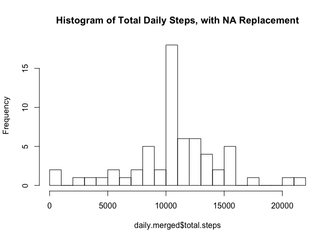

# Reproducible Research: Peer Assessment 1


## Loading and preprocessing the data

```r
# Load the dataset from the activity.csv file in the same directory
dataset <- read.csv('activity.csv')
```

## What is mean total number of steps taken per day?


```r
# Calculate the total number of steps taken per day.
# Include the plyr library to be able to use the ddply function
library(plyr)

# Sum the total number of steps by date
daily <- ddply(dataset, "date", summarize, total.steps = sum(steps))

# Make a histogram of the total number of steps taken each day.
hist(daily$total.steps, breaks=20, main='Daily Steps Histogram', xlab='Daily Total Steps')
```

 

Calculate and report the mean and median of the total number of steps taken per day.

```r
# Ignore NA values
daily.mean <- mean(daily$total.steps, na.rm=TRUE)
daily.median <- median(daily$total.steps, na.rm=TRUE)
```
The mean daily steps taken is 10766.19 and the median daily steps taken is 10765.

## What is the average daily activity pattern?

```r
# Make a time series plot (i.e. type = "l") of the 5-minute interval (x-axis) and the average number of steps taken, averaged across all days (y-axis)
# Import the ggplot library
library(ggplot2)

# Calculate a typical day by averaging the number of steps taken at each interval
typical.day <- ddply(dataset, "interval", summarize, avg.steps = mean(steps, na.rm=TRUE))

# Plot a typical day line graph
ggplot(data=typical.day, mapping=aes(x=interval, y=avg.steps)) + geom_line() + labs(x='5 Minute Interval', y='Average Steps')
```

 

Which 5-minute interval, on average across all the days in the dataset, contains the maximum number of steps?

```r
# Order the data frame by average steps descending to find the interval with the most steps
ordered <- arrange(typical.day, desc(avg.steps))
# Now you can look at the first row to find the interval with the highest average number of steps
```
The interval with the maximum number of steps is ``835``.

## Imputing missing values

```r
# Calculate and report the total number of missing values in the dataset (i.e. the total number of rows with NAs)
# Subset the dataset to find the rows with missing values
na.dataset <- subset(dataset, subset = is.na(steps))
```
There are ``2304`` rows with missing values.


```r
# Devise a strategy for filling in all of the missing values in the dataset. The strategy does not need to be sophisticated. For example, you could use the mean/median for that day, or the mean for that 5-minute interval, etc.
# I have chosen to replace the missing value with the average for that 5-minute interval.
# Merge the na.dataset with the typical day dataset on the interval column
na.merged <- merge(x=na.dataset, y=typical.day, all.x = TRUE, all.y = FALSE, by = 'interval')
na.merged$steps <- na.merged$avg.steps

# Create a new dataset that is equal to the original dataset but with the missing data filled in.
# Merge on date and interval
dataset.merged <- merge(x=dataset, y=na.merged, all.x=TRUE, all.y=FALSE, by=c('date','interval'))
# Create a new column
dataset.merged$steps <- 0
# If one value for steps.? is missing, replace the steps variable for the one that is set
dataset.merged[is.na(dataset.merged$steps.x)==TRUE,]$steps <- dataset.merged[is.na(dataset.merged$steps.x)==TRUE,]$steps.y
dataset.merged[is.na(dataset.merged$steps.y)==TRUE,]$steps <- dataset.merged[is.na(dataset.merged$steps.y)==TRUE,]$steps.x
# Subset the new dataset to include only the necessary columns
dataset.merged <- subset(dataset.merged, select=c('steps', 'date', 'interval'))

#Make a histogram of the total number of steps taken each day and Calculate and report the mean and median total number of steps taken per day.
daily.merged <- ddply(dataset.merged, "date", summarize, total.steps = sum(steps))
hist(daily.merged$total.steps, breaks=20, main='Histogram of Total Daily Steps, with NA Replacement')
```

 

```r
daily.mean2 <- mean(daily.merged$total.steps)
daily.median2 <- median(daily.merged$total.steps)
```
The mean daily steps taken is 10766.19 and the median daily steps taken is 10766.19.

**Do these values differ from the estimates from the first part of the assignment? What is the impact of imputing missing data on the estimates of the total daily number of steps?**
The mean value is the same as in the first part of the assignment, but the median now matches the mean and is slightly higher than in the first part of the assignment.  Comparing the histograms to one another, the frequency of days around the mean is much higher than it was before.

## Are there differences in activity patterns between weekdays and weekends?

```r
# For this part the weekdays() function may be of some help here. Use the dataset with the filled-in missing values for this part.
# Create a new factor variable in the dataset with two levels – “weekday” and “weekend” indicating whether a given date is a weekday or weekend day.

# Determine the weekday of the date
dataset$weekday <- weekdays(as.Date(dataset$date))
# Map the day name values to weekend or weekday
dataset$weekday <- mapvalues(dataset$weekday, from=c('Monday', 'Tuesday', 'Wednesday', 'Thursday', 'Friday', 'Saturday', 'Sunday'), to=c('Weekday', 'Weekday', 'Weekday', 'Weekday', 'Weekday', 'Weekend', 'Weekend'))

#Make a panel plot containing a time series plot (i.e. type = "l") of the 5-minute interval (x-axis) and the average number of steps taken, averaged across all weekday days or weekend days (y-axis).
typical.days <- ddply(dataset, c("interval","weekday"), summarize, avg.steps = mean(steps, na.rm=TRUE))
ggplot(data=typical.days, mapping=aes(x=interval, y=avg.steps)) + geom_line() + facet_wrap(~weekday, ncol=1, nrow=2) + labs(title="Weekday vs Weekend Typical Days", x="5 Minute Interval", y="Average Steps")
```

 
